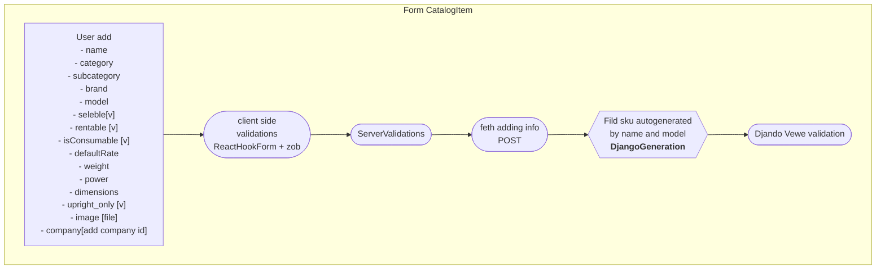

```mermaid
graph TB
    subgraph Form CatalogItem
        
        Action([feth adding info 
        POST])
        
        zobServer([ServerValidations])
        fildSku{{"`Fild sku autogenerated 
        by name and model
        **DjangoGeneration** `"}}
        
        zobClient([client side 
        validations 
        ReactHookForm + zob ])
        
        form["`User add 
        - name
        - category
        - subcategory
        - brand
        - model 
        - seleble[v]
        - rentable [v]
        - isConsumable [v]
        - defaultRate
        - weight
        - power
        - dimensions
        - upright_only [v]
        - image [file]
        - company[add company id]`"]
        
        djangoValidation([Djando Vewe validation])
        
        form --> zobClient --> zobServer --> Action --> fildSku --> djangoValidation
    end
    
    
    
    
```